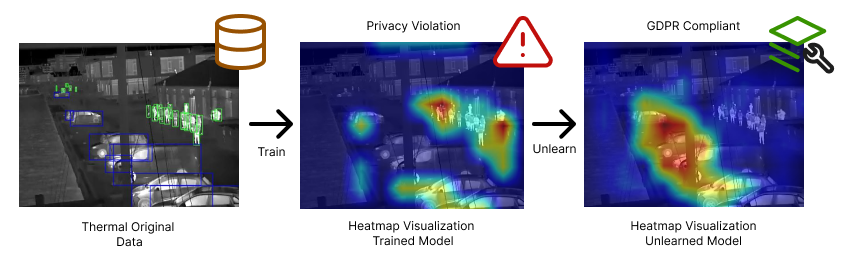

# Explaining Unlearning

## Setup
### Requirements
This repository should work with any pytorch>=2.0 and Timm>=1.0 it has been tested with the following:
 * timm==1.0.3
 * torch==2.2.1
 * matplotlib==3.9.0
 * pandas==2.2.2
 * pyaml==24.4.0
 * tqdm
 * wandb==0.17.0

## Demo / Inference
Run the demo of one of the provided models, execute the following code, with the desired input images (Examples provided in data/example_data/)
```
python demo.py configs/explain.yaml path/to/config.yaml path/to/weights.pt ... --visualization --heatmap
```
'...' denote any number of images or folder containing images of the following filetypes: ".jpg", ".png", ".bmp".

The output of this demo will be automatically saved in './assets/demo/' unless otherwise specified. 

## Weights and Data
Weights and data for the Test/Explain/Demo scripts can be found below.
Note: The data is currently private, with the aim to publish it soon. Until then some examples are provided to allow for demoing as well as introducing the expected file stucture.

### Weights
| Model Name    | Weights     | Config                  |
| ------------- | ------------| ------------------------|
|Original       | Link (Soon) | configs/original.yaml   |
|Retrain        | Link (Soon) |configs/retrain.yaml     |
|Finetune       | Link (Soon) |configs/finetune.yaml    |
|Prune          | Link (Soon) |configs/prune.yaml       |
|Reinit         | Link (Soon) |configs/reinit.yaml      |
|Confused       | Link (Soon) |configs/confuse.yaml     |

## Explain / SIDU Explanations
This can be done by with one of the pretrained  model weights available above or by :
```
python train.py configs/explain.yaml path/to/config.yaml path/to/weights.pt --visualization --heatmap --mask --boundingbox
```
This saves overlaid visualization, rasterized heatmap, raw heatmap, class-wise-masks and visualized bounding boxes in './assets/explained/'

## Train
The model is initially trained with a baseline whereafter a desired class can be targeted for unlearning.
The trained models are saved in './assets/train/'

Note: If using custom data, the HarborfrontDataloader class in 'utils/dataloader.py' needs the 'CLASS_LIST' updated, and the data needs to follow the structure shown in "example_data/".

### Traning the baseline
This is done simply by running:
```
python train.py configs/original.yaml
```
or for the baseline model that hasn't learned to recognize humans:
```
python train.py configs/retrain.yaml
```

### Training (With unlearning)
```
python train_mu.py ...
```
## Test
Testing is generally run: 
```
python test.py 'path/to/config.yaml' 'path/to/model/weights.pt'
```
Note: Results yielded by this is not the same as in the paper, as the paper uses the complete dataset.